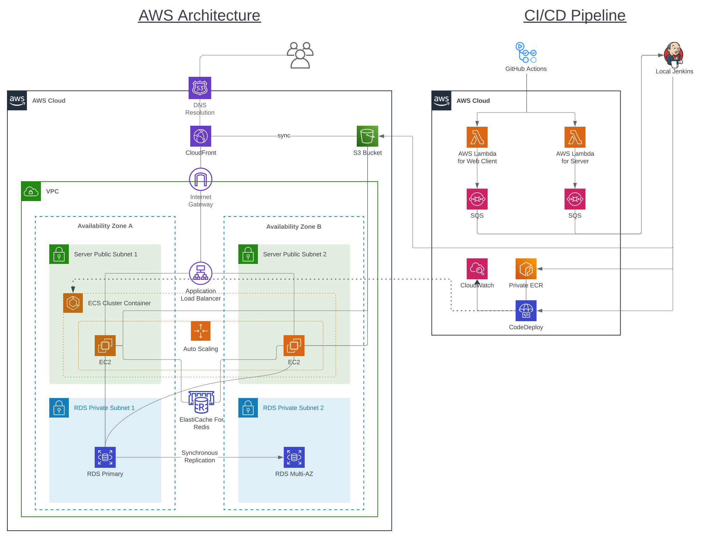

# Zigoom

**Zigoom** is a web-based video group chat application designed initially for personal use. I'm now adding more features to accommodate a variety of use cases. Since it was built with an **experimental** design, it may not be ideal for everyone.

 

## Limitation

For the educational purpose, I utilized especially: **ECS** and **Blue/Green deployment strategy**. And this service is running on following free tier resources:

- EC2: `t2.micro`
- RDS: `db.t3.micro`
- ElastiCache: `cache.t2.micro`

WebSocket peers are connected by P2P(so to avoid cpu usages from server).

But I'm planning to resolve this by [another approach (#39)](https://github.com/SeiwonPark/zigoom/issues/39) if this shows [bad performance (#41)](https://github.com/SeiwonPark/zigoom/issues/41).

 

## Architecture

Overall architecture and pipeline.
