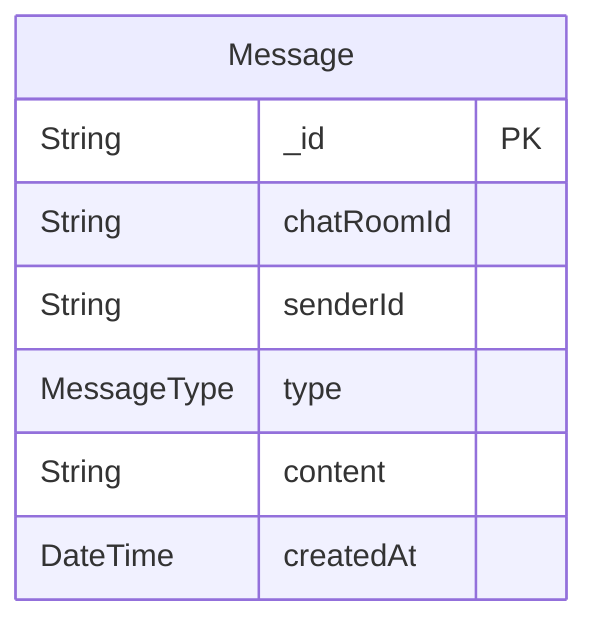

# Goom
> Generated by [`prisma-markdown`](https://github.com/samchon/prisma-markdown)

- [default](#default)

## default

### `Message`

**Properties**
  - `_id`: 
  - `chatRoomId`: 
  - `senderId`: 
  - `type`: 
  - `content`: 
  - `createdAt`: 