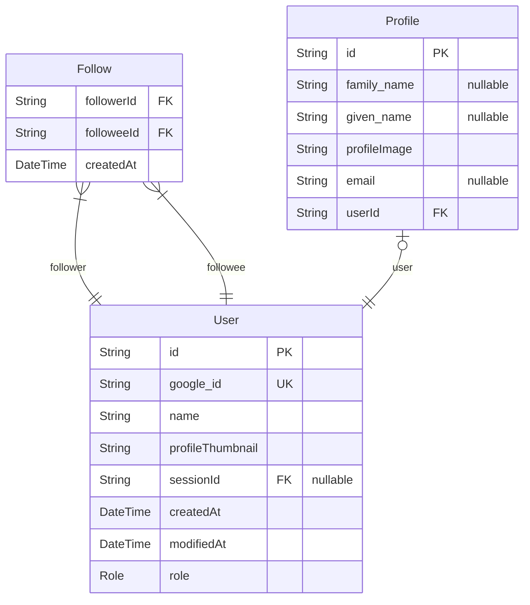
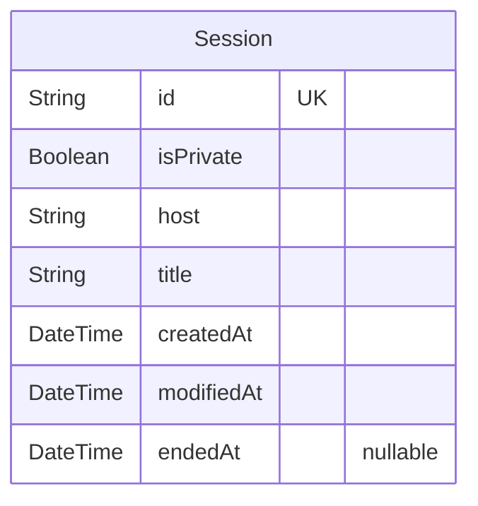
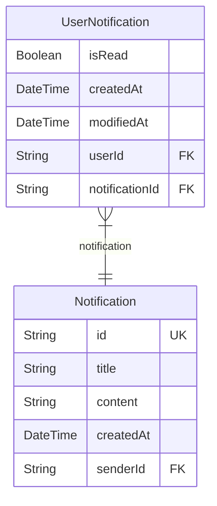
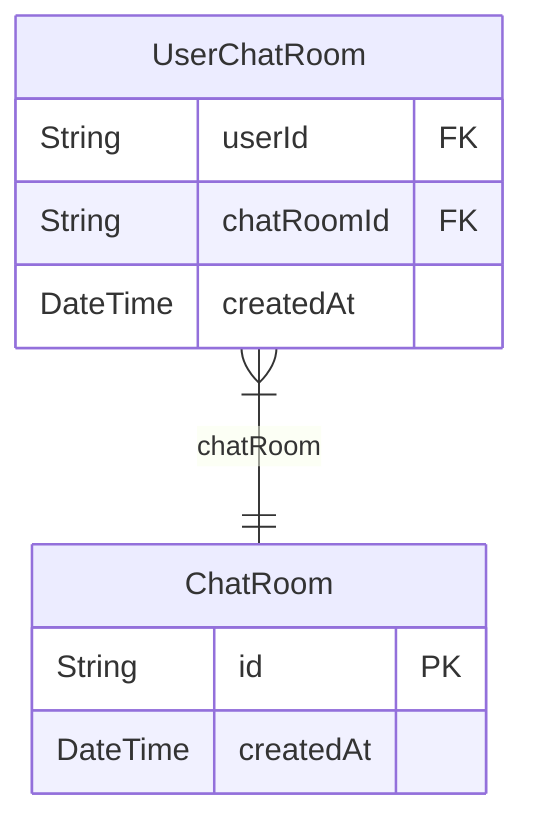

# Goom
> Generated by [`prisma-markdown`](https://github.com/samchon/prisma-markdown)

- [Actors](#Actors)
- [Sessions](#Sessions)
- [Notifications](#Notifications)
- [Chats](#Chats)
- [User](#User)

## Actors

### `User`

**Properties**
  - `id`: User's ID.
  - `google_id`: 
  - `name`: 
  - `profileThumbnail`: 
  - `sessionId`: 
  - `createdAt`: 
  - `modifiedAt`: 
  - `role`: 

### `Follow`

**Properties**
  - `followerId`: 
  - `followeeId`: 
  - `createdAt`: 

### `Profile`

**Properties**
  - `id`: 
  - `family_name`: 
  - `given_name`: 
  - `profileImage`: 
  - `email`: 
  - `userId`: 

## Sessions

### `Session`

**Properties**
  - `id`: 
  - `isPrivate`: 
  - `host`: 
  - `title`: 
  - `createdAt`: 
  - `modifiedAt`: 
  - `endedAt`: 

## Notifications

### `Notification`

**Properties**
  - `id`: 
  - `title`: 
  - `content`: 
  - `createdAt`: 
  - `senderId`: 

### `UserNotification`

**Properties**
  - `isRead`: 
  - `createdAt`: 
  - `modifiedAt`: 
  - `userId`: 
  - `notificationId`: 

## Chats

### `ChatRoom`

**Properties**
  - `id`: 
  - `createdAt`: 

### `UserChatRoom`

**Properties**
  - `userId`: 
  - `chatRoomId`: 
  - `createdAt`: 